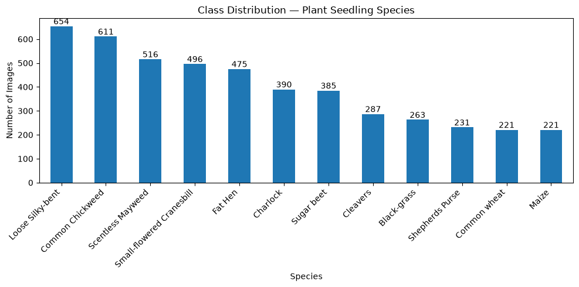
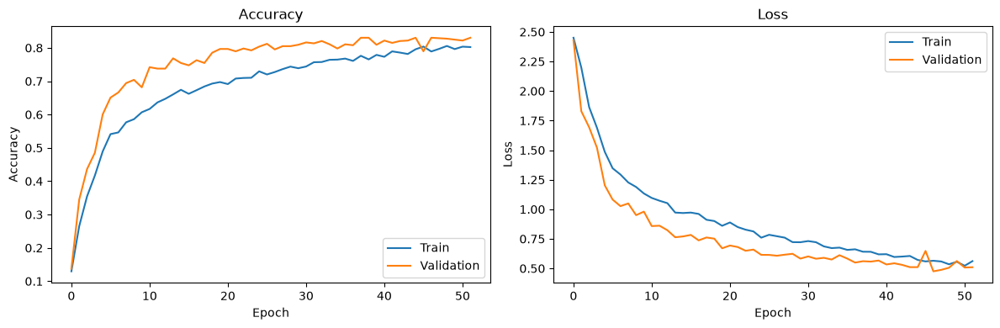
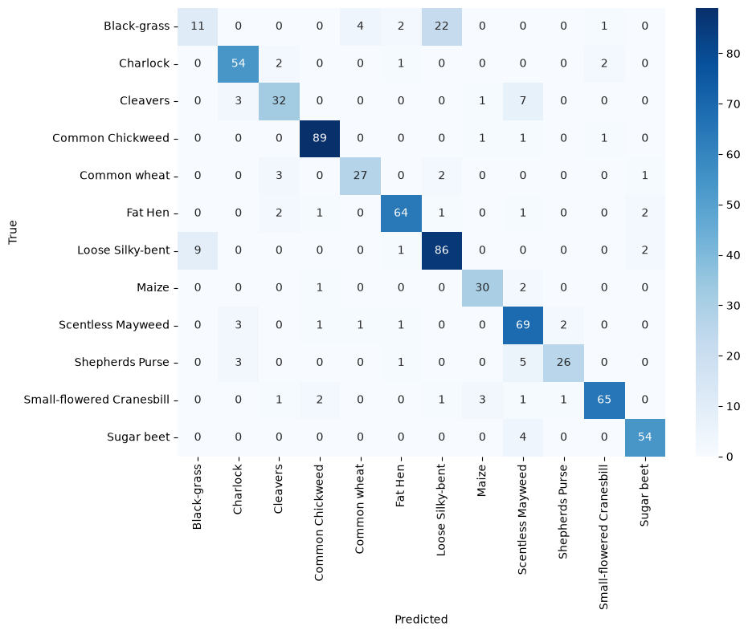

## Plant Seedling Classification with a CNN

A convolutional neural network that identifies 12 species of plant seedlings from images, built with TensorFlow and Keras. Telling crop seedlings apart from weeds early is a real agricultural problem: it determines where herbicide goes and how much of it is needed.

Result: 85.1% accuracy on a held-out test set (macro F1 0.82), with most errors concentrated in one pair of visually similar grass species.

### Data

4,750 RGB images (128×128) across 12 species, from the Plant Seedlings Classification dataset published by Aarhus University. The dataset is not included in this repo because of its size (images.npy is 233 MB).

The classes are imbalanced. Loose Silky-bent has 654 images, while Maize and Common wheat have 221 each. This means stratification is necessary.

## Approach

### Preprocessing

Label-encoded the 12 species.
Stratified 70/15/15 train/validation/test split, so every class keeps its proportions in each set.
Resized images from 128×128 to 64×64 to reduce training time.
Pixel scaling (from 0-255 to 0-1) is done inside the model with a Rescaling layer, so the saved model accepts raw images.

### Model

Built-in augmentation includes random flips, rotation (+-20%), and zoom (+-20%). Seedlings are photographed from above, so orientation carries no meaning, and augmentation helps the model generalize from a small dataset.
Three convolutional blocks (32 -> 64 -> 128 filters), each followed by max pooling.
Dense layer (128 units) with 50% dropout, then a 12 class softmax output.
~1.14M parameters

### Training

Adam optimizer with a learning rate of 0.001, sparse categorical cross-entropy loss.
Early stopping on validation loss with patience of 5, restoring the best weights. Training ran 52 epochs. The best was epoch 47.

Training accuracy (0.79) sits below validation accuracy (0.83) at the best epoch. This is expected as augmentation and dropout are only active during training, so the training batches are harder than the validation data.

### Results
Training accuracy:   0.7891 \
Training loss:       0.5647 \
Validation accuracy: 0.8303 \
Validation loss:     0.4753

Most species score an F1 of 0.80 or higher, led by Common Chickweed (0.96) and Sugar beet (0.92).

The weak spot: Black-grass

Black-grass is the outlier, with a recall of 0.28 (F1 0.37). The confusion matrix shows that 22 of the 40 Black-grass test images were predicted as Loose Silky-bent, and 9 Loose Silky-bent images went the other way.

Both species are thin grass blades that look nearly identical at the seedling stage which reveals two 
limitations of the model:

Class imbalance. Loose Silky-bent has about 2.5× as many images (654 vs 263), so when the model is unsure between the two, it leans toward the larger class.
Resolution. Downscaling to 64×64 probably removes the fine blade detail that distinquishes them.
### Posible improvements
Apply balanced class weights during training to counter the Black-grass/Loose Silky-bent imbalance, and compare macro F1 against these initial results.
Train at a higher resolution (96 or 128)