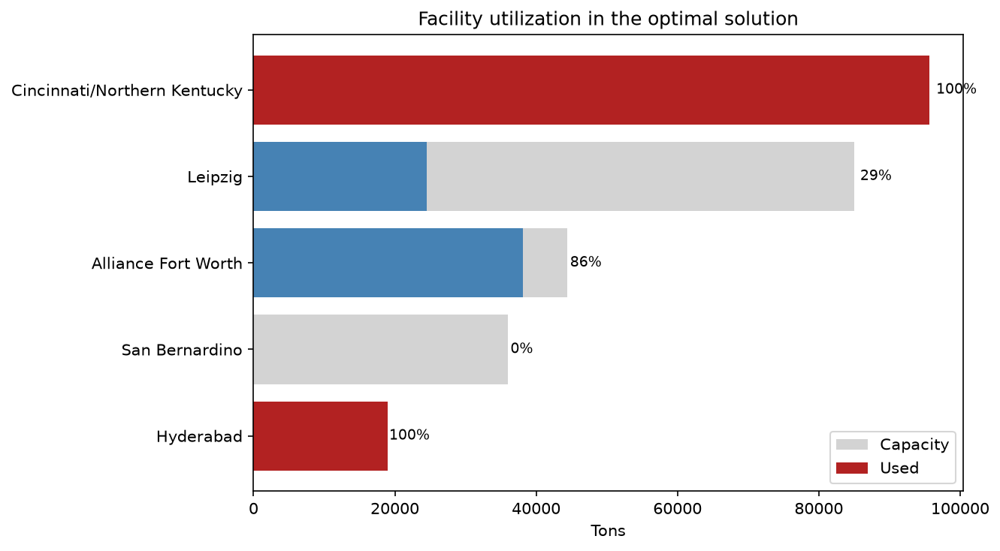

# Air Cargo Distribution Optimization

A linear programming problem that routes 133,747 tons of air cargo through a multi-tiered distribution network while minimizing cost using PuLP and solving with CBC.

**Result:** $182,376.25 total cost across 68 used lanes. The optimal solution leaves one of the 3 regional facilities (San Bernardino) completely unused while running the main U.S. hub (Cincinnati) at 100% capacity. This identifies where the model is constrained and where improvements may be made.

## The problem

133,747 tons of air cargo move from two national hubs (Cincinnati, Fort Worth) to 65 distribution centers. Cargo can travel directly from a hub to a center or route through one of three regional focus cities (San Bernardino, Leipzig, Hyderabad). Each lane has a per-ton cost, each hub and focus city has a capacity limit, and each distribution center has a fixed demand that must be met exactly.

The question the solution solves is, "Which lanes should be used and at what volume in order to meet all center demands while minimizing shipping costs?"

## Data

nodes.csv holds node IDs, types, capacities, and demand. lanes.csv holds potential origin -> destination pairs and their per-ton cost. Total center demand is 133,747 tons and total hub capacity is 140,000 tons which leaves about 4.5% slack.

## Model

**Decision variables** - 192 variables split by echelon
hub -> focus city: 4
hub -> center: 106
focus city -> center: 82

**Objective** - Minimize the sum of cost x tons across all lanes

**Constraints** - 73 total
- Hub capacity
- Focus city throughput capacity
- Center demand
- Flow conservation

## Validation

Before building the model, the notebook asserts that every lane endpoint exists in the node table, that node counts match expectations, that no duplicate lanes exist, and that no center is stranded without an inbound lane. After solving, it recomputes the objective from the extracted flows, confirms every center's demand gap is zero, and verifies flow balance at each focus city.

## Results

**Status:** Optimal. Total cost $182,376.25, with 68 of the 192 available lanes carrying cargo.

Hub -> focus city: 2 lanes, 43,470 tons, $67,105.00 cost

Hub -> center: 62 lanes, 90,277 tons, $69,066.25 cost

Focus city -> center: 4 lanes, 43,470 tons, $46,205.00 cost

About two-thirds of volume (90,277 tons) moves directly from hubs to centers. The rest routes through focus cities.

**San Bernardino goes unused.**
Of the three focus cities, only Leipzig and Hyderabad carry any freight. San Bernardino receives zero tons despite 36,000 tons of capacity. Under the current cost structure and demand pattern, routing through it never beats shipping direct, which suggests the facility is redundant at this demand level.

Cincinnati:	95,650 tons used of 95,650 capacity	(100.0%)

Fort Worth:	38,097 tons used of	44,350 capacity	(85.9%)

**Cincinnati is the binding constraint** as it runs at capacity while Fort Worth has 6,253 tons of headroom. Hyderabad is also fully saturated at 19,000 tons. These are the points where adding capacity would reduce total cost.

The three most expensive lanes are CVG -> Leipzig (24,470 tons, $36,705), CVG -> Hyderabad (19,000 tons, $30,400), and Leipzig -> C07 (14,800 tons, $22,200).